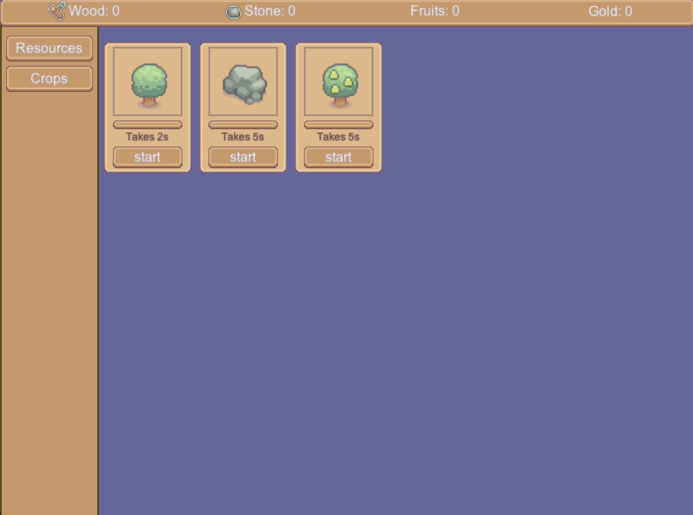
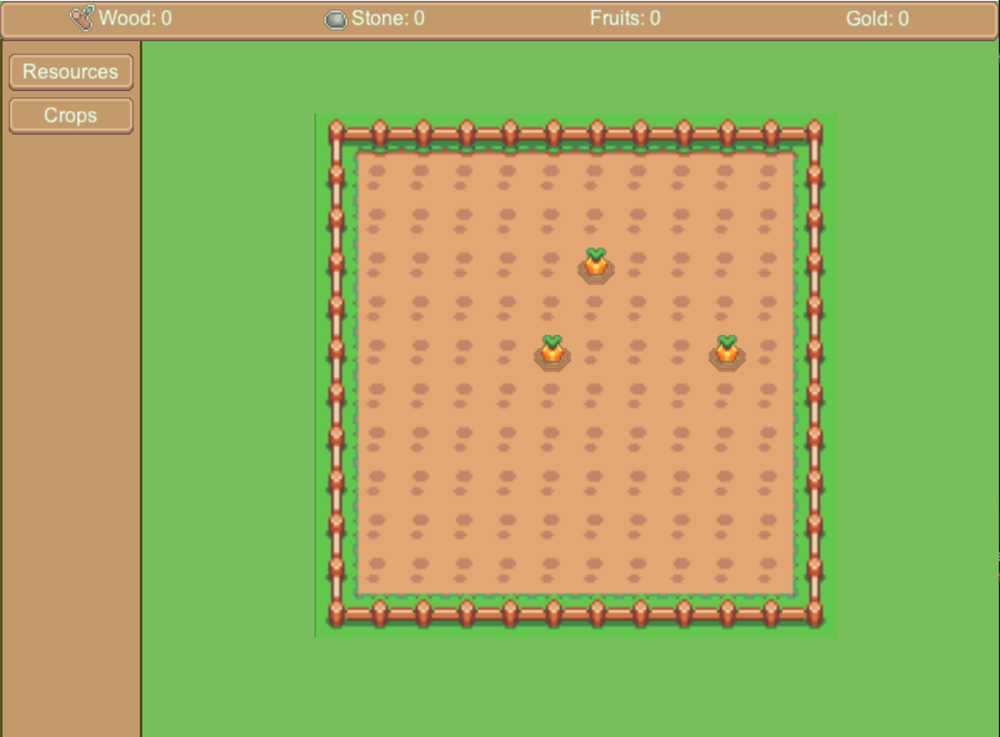

# IDlE Game

This is not a real game. It is an example what is possible using the arcade library and the included gui system.

In addition, it helps to use your own library.

## Idea

Requirements for a GUI demo game:
- main interaction/content should be the GUI
- use game mechanics that require a wide variety of GUI widgets (progress bars, buttons, notifications, menues, slider, ...)
- code should be easy to locate ("how is this part of the game implemented?")

Approach:

Idle game, containing different "mini" games

## Gallery

## possible Backlog (WIP)

- [x] Navigation between arcade.Views
- [x] Show resources in a top bar
- [x] Show cards with different actions to get resources
- [x] Toast when a new resource gained
- [x] Use UIGridLayout for a crop field 
- [x] Place seeds 
- [ ] Collect crops
- [ ] Store collected crops in a inventory
- [ ] consume seeds from inventory
- [ ] clean up tool, some stones and gras on the field
- [ ] Some option to save/load game
- [ ] Character moving on a map, depending on the place en/disable mini games in sidebar

## Things to demo
- [x] Progress bar
- [x] Transitions/Animations
- [x] Change views
- [x] UI used on multiple views
- [ ] GridView
